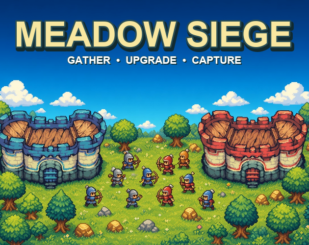

# Meadow Siege

A compact pixel-art strategy game built with Phaser. Gather resources, upgrade
your pawns into warriors, defeat the guards, and capture Redstone Keep.

## Controls

- Click a blue unit to select it.
- Shift-click to select multiple units.
- Right-click the ground to move.
- Right-click resources to gather them.
- Right-click enemies or the red castle to attack.
- Press `U` to upgrade a pawn.

## Stack

- Phaser
- TypeScript
- Vite
- Cloudflare Workers

## License

[MIT](LICENSE)
